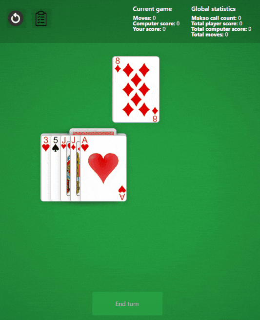

# Makao - React/Redux

My favorite cards game - Makao. 
WORK in progress - playable, not all features have been rewritten yet

Original version - https://github.com/piotreksko/Makao
## [Live Demo](https://makao-win-counter.firebaseapp.com/)



## About 
In this game you can play a 1v1 game of a cards game called [Macao](https://en.wikipedia.org/wiki/Macau_(card_game)) 
Developed with React and Redux.

## Global statistics
The game keeps track of particular statistics in all the games that were played since this feature has been introduced. The statistics are: 

* Total moves 
* Total macao calls 
* Total player wins 
* Total computer wins 

## About the Artificial Intelligence
### My analysis & opinion
* After being tested by me for 80 games the statistics are - 1676 total moves, 199 macao calls, 53 player wins, 27 computer wins.
* Averages per game are 21 moves, 2.5 macao calls.
* Computer's winrate against me is 34%.
* All the statistics are based on my games only. Considering that I have played macao a few thousand times over the past years, 34% winrate is far from perfect, but is not bad.
* The AI has a very similar playstyle to mine & I am the creator which surely makes it unfair for the computer.
* The average amount of 21 moves means that the computer stands a good fight and does not easily let the player win.
* Big downside of the AI is that it only looks 1 move ahead and does not have a strategy at winning the game.
* Based on watching some of friends with varied levels of experience in Macao I presume that the algorithm is good against amateur players, but not that great against more experienced ones.
### The AI
* Before each move the computer determines based on the game rules, which cards is it allowed to use. 
* All it's available cards get grouped into groups such as neutral cards and all action cards subgroups eg.battle card or aces
* The AI does not have hardprogrammed moves - so there's always a bit of randomness and unpredictability. 
* It estimates a probability range for all cards groups based on the current game situations. Some of the factors it considers for calculating ranges are numbers of cards the computer and player have, number of cards in each group or the number of cards within the same suit or weight.
* Each cards group has a different algorithm to determine the probability
* For example the less cards player has, the higher probability will be for computer to use a battle card to make the player take more cards from the deck thus preventing him from finishing the game.

AI example

```
Computer has 5 cards. Player has 8 cards.
Player uses 10 of hearts. 
Out of all computers' cards he can use 10 of Spades, 3 of Hearts or Jack of Hearts. 
8 is a neutral card, 3 is a battle card and Jack is an action card.
Computer calculates probability ranges for all the types.
The range for neutral card will be 1 to 30, for battle card 30 to 43, for jack from 43 to 83.
Computer gets a random number between 1 and 83 - it get's 57.
57 is within jack range therefore the card to use will be Jack of Hearts.
```

## Game rules in this Macao version

### Gameplay

* Players are dealt 5 cards each; the deck is then cut and the cut card becomes the first card in the discard pile. Play starts randomly.
* The next card played must be of the same suit or the same value as the card on the top of the discard pile. If a 7 of spades was on the top of the discard pile, the player can play a 9 of spades or a 7 of clubs. If the player cannot play a card, he must draw from the deck.
* Cards can be played in runs, i.e. 5 of Spades, 5 of Diamonds, 5 of Hearts.
* When an action card is played, the player next in sequence must complete the action or add to it to pass in onto the next player in sequence.
* When down to a single card, a player must say "Macao!". The winner of the game is the first player to have no cards;

### Action cards

* If a 2 is played, the next player in sequence must pick up 2 cards unless they have a 2, in which case they can add this to the original 2 and the next player in sequence must pick up 4 cards and so on.
* If a 3 is played, the next player in sequence must pick up 3 cards unless they have a 3, in which case they can add this to the original 3 and the next player in sequence must pick up 6 cards and so on.
* If a 4 is played, the next player in sequence must miss a go, unless they have a 4, in which case they can add this to the original 4 and the next player in sequence miss 2 goes.
* If a Jack is played, the player placing the Jack can call for a non-action card value, him and the player in sequence must either play the card value called or place another Jack down and call a different value.
* If a King of Spades is played, the previous player in sequence must pick up 5 cards, unless they have a King of Hearts, in which case they can add this to the original King and the next player in sequence must pick up 10 cards.
* If a King of Hearts is played, the next player in sequence must pick up 5 cards, unless they have a King of Spades, in which case they can add this to the original King and the next player in sequence must pick up 10 cards.
* If a King of Hearts is played or King of Spades is played, the player who must pick up cards can use King of Diamonds or King of Clubs to defend himself and not take any cards.
* If an Ace is played, the player playing the Ace can call a suit suit of choice.

Multiples action cards can be played, i.e. Player 1 plays three 2s and the next player in sequence must pick up 6 cards unless they have another 2. This is the same for 3's, 4's and Kings.

### Things to improve:

* AI algorithm
* More features e.g. more AI players
* Convert to another framework.
